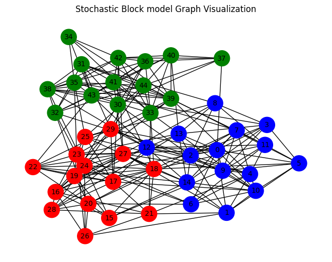

# Machine Learning with Graphs Library

This Python library offers a comprehensive suite of graph-based machine learning algorithms, designed for ease of use and versatility.

## Features
- **Graph Neural Networks (GNNs)**: Includes GCNs, GATs, and more.
- **Graph Clustering Algorithms**: Features Spectral Clustering, Louvain method, and others.
- **Graph Embedding Methods**: Implements Node2Vec, DeepWalk, etc.
- **Diverse Range of Algorithms**: For various graph-based learning tasks.

## Installation
```bash
pip install machine_learning_with_graph
```

## Usage
Scripts in the examples folder demonstrate various algorithms' usage.

Example to integrate spectral clustering method
```python
import networkx as nx
from networkx.generators.community import stochastic_block_model
from ml_wg.clustering.spectral import SpectralClustering
import numpy as np

# Create a Stochastic Block Model graph
sizes = [15, 15, 15]  # Sizes of each block
p_matrix = [[0.5, 0.1, 0.05],
            [0.1, 0.5, 0.1],
            [0.05, 0.1, 0.5]]  # Probability matrix
G = stochastic_block_model(sizes, p_matrix)

# Get the adjacency matrix
adj_matrix = nx.to_numpy_array(G)

# Apply our spectral clustering library
sc = SpectralClustering(n_clusters=3)
clusters = sc.fit_predict(adj_matrix)

# Create a color map based on cluster labels
color_map = ['red' if clusters[node] == 0 else 'blue' if clusters[node] == 1 else 'green' for node in G.nodes()]

# Draw the network
nx.draw(G, node_color=color_map, with_labels=True, node_size=500, font_size=10)
plt.title("Stochastic Block model Graph Visualization")
plt.show()

```

Output:



## Testing 
Run tests using pytest:
```bash
pytest
```


## Contributing
Contributions are welcome! See CONTRIBUTING.md for guidelines.

## Developer Guide

To contribute to the project, follow these steps to set up a local development environment:

1. **Clone the Repository**:
```bash
git clone https://github.com/susheelg1197/machine-learning-with-graphs-lib.git
cd machine-learning-with-graphs-lib

```


2. **Create and Activate a Virtual Environment** (optional but recommended):
```bash
python -m venv venv
source venv/bin/activate # On Windows use venv\Scripts\activate
```

3. **Install Dependencies**:
```bash
pip install -r requirements.txt
```


4. **Make Changes**:
- Implement new features or fix bugs.
- Write tests to ensure functionality.

5. **Testing**:
Add test cases within testing folder
```
pytest
```

6. **Commit Your Changes**:
```bash
git add .
git commit -m "Your detailed description of changes"

```


7. **Push to Your Fork and Create a Pull Request**.

Please ensure your code adheres to the project's coding standards and include tests for new features.


